# F.A.Q - FRDM-KL25Z

Criado por Matheus Santos de Oliveira (PAD 2016)

Editado por Ricardo Bonna (PED 2017), Alexandre Maranhão (COMP-23) e Davi Muniz (COMP-23).

## Perguntas

  - [01 Qual a pasta que preciso por no SDK Absolute Path ao criar um projeto?](#01-qual-a-pasta-que-preciso-por-no-sdk-absolute-path-ao-criar-um-projeto)
  - [02 O que devo fazer depois de criar o projeto?](#02-o-que-devo-fazer-depois-de-criar-o-projeto)
  - [03 Kinetis Design Studio não detecta o microcontrolador no Ubuntu](#03-kinetis-design-studio-não-detecta-o-microcontrolador-no-ubuntu)
  - [04 Como usar o modo de debug em um programa?](#04-como-usar-o-modo-de-debug-em-um-programa)
  - [05 Baixei os códigos fornecidos, coloquei-os na pasta Sources do meu projeto, mas não consigo dar build no projeto. Aparecem alguns erros nos meus includes.](#05-baixei-os-códigos-fornecidos-coloquei-os-na-pasta-sources-do-meu-projeto-mas-não-consigo-dar-build-no-projeto-aparecem-alguns-erros-nos-meus-includes)
  - [06 Não entendo o que são esses símbolos de atribuição nem o que significam os comandos utilizados para declarar, inicializar e configurar pinos.](#06-não-entendo-o-que-são-esses-símbolos-de-atribuição-nem-o-que-significam-os-comandos-utilizados-para-declarar-inicializar-e-configurar-pinos)
  - [07 Estou tentando entender quais portas preciso utilizar, mas olhando na tabela do Marcílio de equivalência PIC x ARM vejo PTA, PTB, PTC... E não encontro eles no datasheet!](#07-estou-tentando-entender-quais-portas-preciso-utilizar-mas-olhando-na-tabela-do-marcílio-de-equivalência-pic-x-arm-vejo-pta-ptb-ptc-e-não-encontro-eles-no-datasheet)
  - [08 Configuração para utilização do timer como contador](#08-configuração-para-utilização-do-timer-como-contador)
  - [09 Como faço para utilizar rotinas de interrupção no meu projeto?](#09-como-faço-para-utilizar-rotinas-de-interrupção-no-meu-projeto)

### 01 Qual a pasta que preciso por no SDK Absolute Path ao criar um projeto?

<p align="center">
  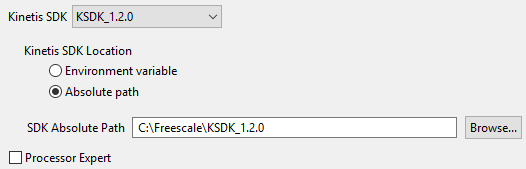
</p>

### 02 O que devo fazer depois de criar o projeto?

#### 02.1 Incluir a biblioteca do target no workspace.

<p align="center">
  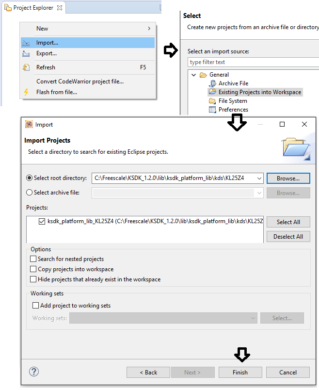
</p>

#### 02.2 Realizar os Includes para linkar a biblioteca com o seu projeto.

<p align="center">
  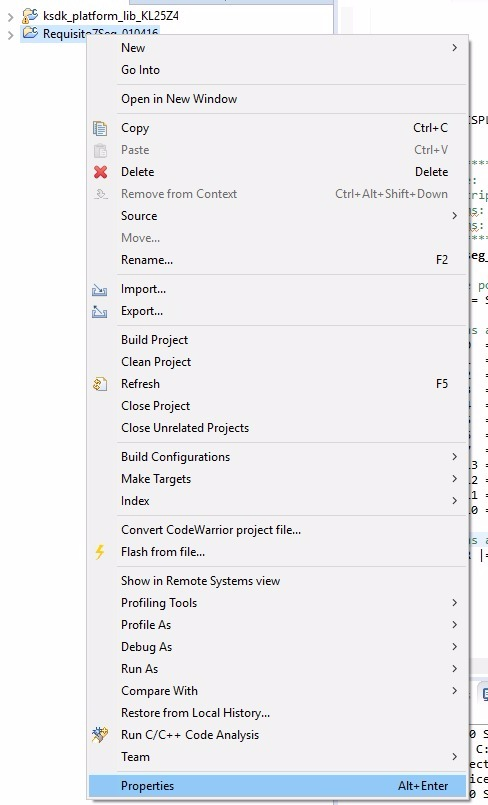
</p>

<p align="center">
  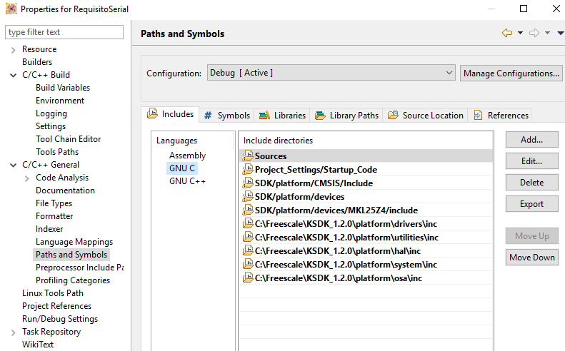
</p>

<p align="center">
  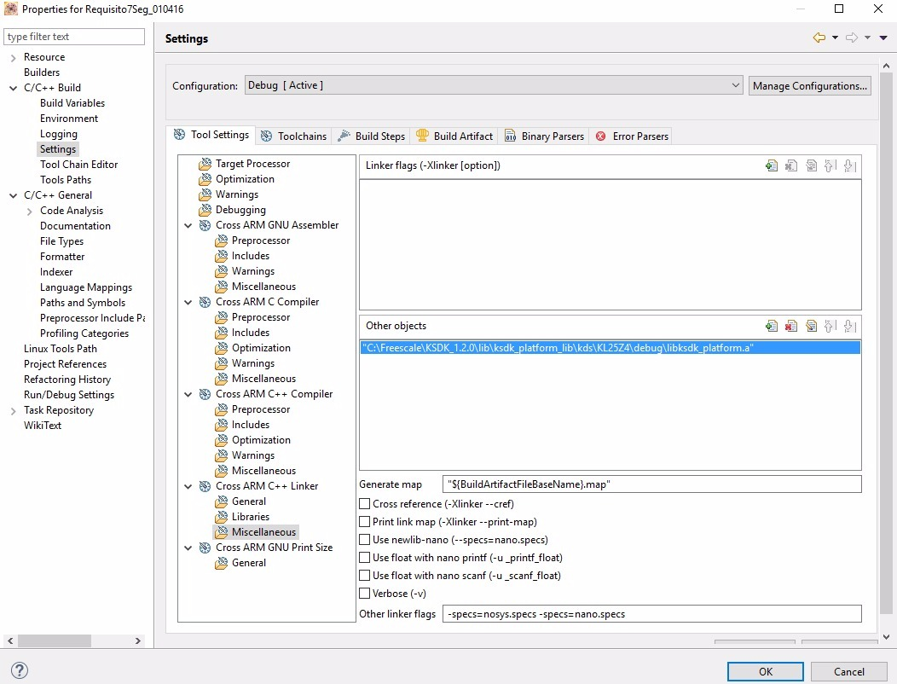
</p>

### 03 Kinetis Design Studio não detecta o microcontrolador no Ubuntu
Instale o libusb-dev,

```
sudo apt get install libusb-dev.
```
Testado no Ubuntu 18.04.

### 04 Como usar o modo de debug em um programa?

<p align="center">
  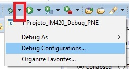
</p>

<p align="center">
  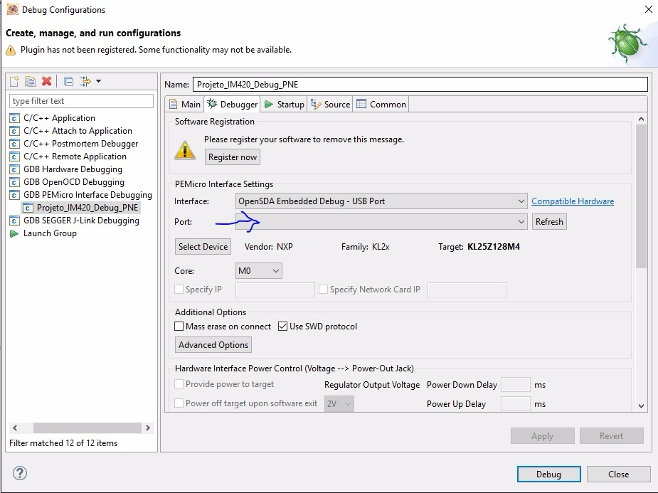
</p>

A seta deve indicar a porta USB que sua placa está ligada.

#### 04.1 Problema 1: Ao clicar em Debug, um pop-up abriu durante o processo com erro de algo relacionado ao launch sequence.

Verifique se, na configuração de Debug, sua placa está sendo reconhecida ou se o campo Port está vazio, como na imagem acima. Caso esteja vazio, recoloque o cabo USB e verifique se a placa de periféricos está energizada. Caso não esteja, abra o Gerenciador de Tarefas do Windows, procure o processo ``pegdbserver_console``, encerre-o, reinicie o Kinetis Design Studio e tente novamente.

#### 04.2 Problema 2: O debugger pula todos os meus breakpoints ao iniciar o debug / O debbuger parou em pontos onde não defini um breakpoint.

Pode ser que o seu código tenha causado isso. Verifique por loops infinitos além do loop da main.

Verifique se o botão **Skip all breakpoints** não está habilitado.

<p align="center">
  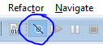
</p>

Verifique também quais são os breakpoints presentes na respectiva aba da visão de Debug.

<p align="center">
  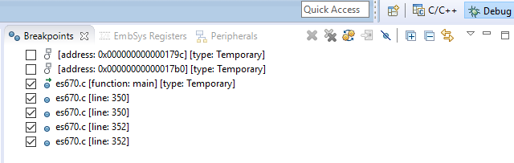
</p>

Muitas vezes o próprio sistema acaba criando breakpoints temporários, ou então, quando há breakpoints demais, ele não consegue inicializar todos (procure por uma mensagem no Console como **Error loading BP at xxx**). Em ambos os casos, vale excluir ou desativar todos os breakpoints presentes na aba da imagem acima e incluir apenas os que sejam relevantes à sua tentativa de Debug.

#### 04.3 Problema 3: Gostaria de verificar o valor de variáveis e registradores durante o Debug.

Realizar as seguintes configurações:

<p align="center">
  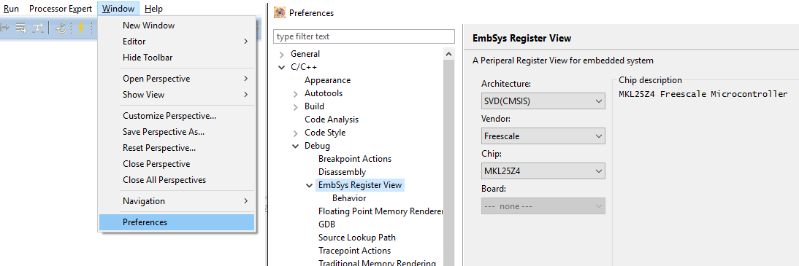
</p>

Ao longo da execução, para verificar o valor de variáveis, selecionar a aba **Variables**. As variáveis locais serão apresentadas automaticamente.

Já para verificar o status dos registradores, selecionar a aba **EmbSys Registers**, selecionar o registrador selecionado e dar dois cliques nos em cima do nome do registrador. Caso seja feito corretamente, os campos ficarão **verdes**.

A atualização dos valores não é em tempo real (caso você pule os breakpoints durante a execução, o valor não será atualizado a cada mudança), é necessário pausar o programa para que estes sejam atualizados. Caso haja mudança em determinado valor, ele ficará **vermelho**.

As informações acima se referem à proxima imagem.

<p align="center">
  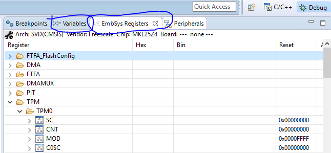
</p>

### 05 Baixei os códigos fornecidos, coloquei-os na pasta Sources do meu projeto, mas não consigo dar build no projeto. Aparecem alguns erros nos meus includes.

<p align="center">
  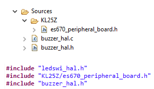
</p>

Verifique se você está realizando os includes dos .h corretamente. Note acima que para incluir o **buzzer_hal** não é necessário indicar em qual pasta ele está, pois o arquivo está na pasta **Sources** diretamente. Já para o **es670_peripheral_board.h** é necessário indicar que ele está dentro da pasta **KL25Z**.

### 06 Não entendo o que são esses símbolos de atribuição nem o que significam os comandos utilizados para declarar, inicializar e configurar pinos.

Boa parte dos comandos, defines, etc fazem parte da biblioteca do target (aquela que você incluiu logo ao criar o projeto, como descreve a resposta da questão 1 deste documento) e estão representados no datasheet do hardware target (os que não são da biblioteca foram definidos pelo autor dos códigos fornecidos, no entanto, fazem menção a características do target presentes no datasheet). Portanto, ele será a sua principal fonte de referência para entender os códigos já fornecidos, assim como para aprender a utilizar recursos em projetos futuros (como o conversor analógico /digital).

Dê uma pesquisada no índice do datasheet, entenda o que são os comandos utilizados nas configurações dos pinos, tente encontrá-los no datasheet, leia as descrições, faça um pouco de esforço para realmente entender o que está acontecendo! Se você preferir escolher o caminho mais fácil de só replicar os passos dos outros, vai apanhar cada vez mais conforme os projetos forem avançando.

[Link para o datasheet.](https://drive.google.com/drive/folders/19BTM93RObiPFyPT3_wgsihktCNbUJMdq)

Vale a pena dar uma revisada em **Operadores Lógicos** em C. Os códigos fornecidos utilizam alguns comandos que atuam diretamente em bits, através de comandos lógicos.

<p align="center">
  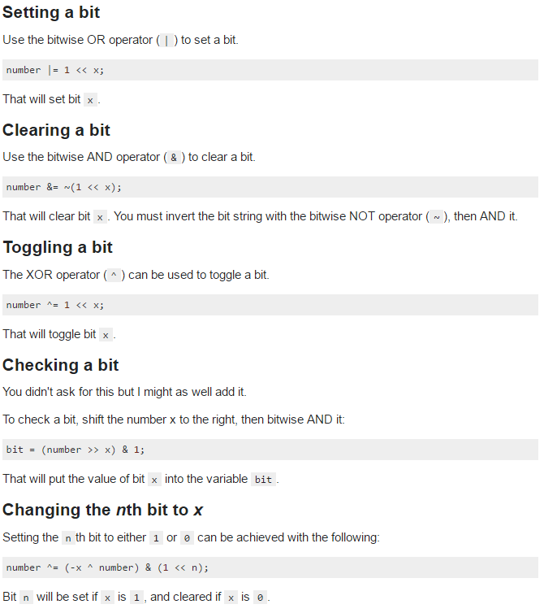
</p>

### 07 Estou tentando entender quais portas preciso utilizar, mas olhando na tabela do Marcílio de equivalência PIC x ARM vejo PTA, PTB, PTC... E não encontro eles no datasheet!

PTXY significa PorTXY, com X = [A, B, C, D, E] e Y = [0, 1, 2, 3, ..., 31].

### 08 Configuração para utilização do timer como contador

<p align="center">
  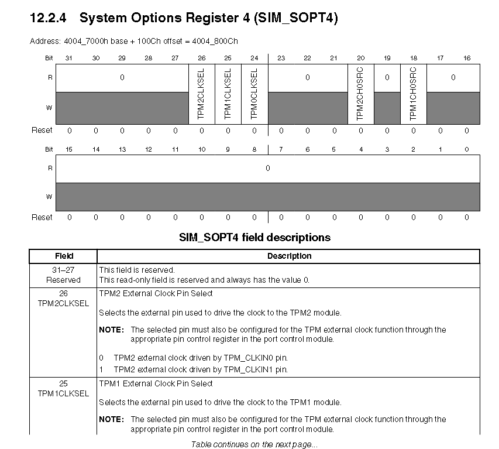
</p>

<p align="center">
  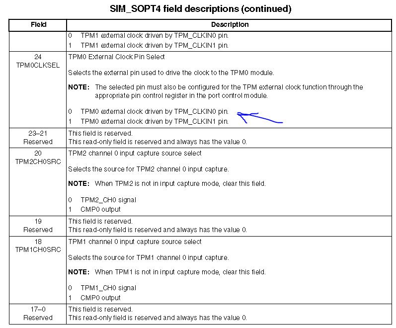
</p>

### 09 Como faço para utilizar rotinas de interrupção no meu projeto?

A utilização de rotinas de interrupção é parte fundamental no projeto de sistemas embarcados. A placa Freescale FRDM-KL25Z possui diversos tipos de interrupções disponíveis. Para utilizá-las, basta saber apenas três coisas: configurar o controlador do vetor de interrupções (NVIC); configurar nos registradores do periférico o tipo de interrupção desejada; e saber o nome da rotina de interrupção relacionada ao periférico que se deseja utilizar.

- Configurar o controlador do vetor de interrupções (NVIC): Se você digitar no seu código no KDS a sigla NVIC e pressionar ``ctrl+SPACE``, algumas opções vão aparecer. Dentre elas o comando ``NVIC_EnableIRQ()`` ativa a interrupção do periférico desejado.

- Configurar nos registradores do periférico o tipo de interrupção desejada: Basta consultar o datasheet, na parte do periférico em questão, o bit que ativa o tipo de interrupção de periférico desejada.

- Nome da rotina de interrupção: Cada periférico possui uma função de interrupção associada cujo nome já é pré-definido. Para encontrar o nome da rotina desejada, basta procurar no arquivo **startup_MKL25Z4.S** que pode ser encontrado em **Project_Settings > Startup_Code** na pasta do seu projeto.

O código a seguir exemplifica a utilização de interrupção de UART0.

```
void UART0_IRQHandler(void){
  ... // codigo da rotina de interrupcao
}

int main(void){
  ...
  NVIC_EnableIRQ(UART0_IRQn);    // habilita interrupcoes de UART0
  UART0_C2_REG(UART0) |= UART0_C2_RIE(1);    // habilita interrupcao para RDRF
  ...
}
```
